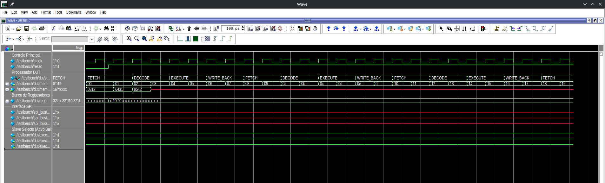

# ProcessadorT1

*Nomes:* Arthur da Rocha Isoppo e Carlos Eduardo Lopes Feijó

## Como executar:

**1. Clone o repositório:**
```bash
cd <Onde você quiser clonar o repositorio>
git clone https://github.com/ArthurIsoppo/SPI---Sistemas-Digitais.git
cd <PATH ATÉ O DIRETÓRIO>
```

**2. Compile os arquivos e simule:**
No diretório do repositorio, acesse o Questa
```bash
vsim
```

